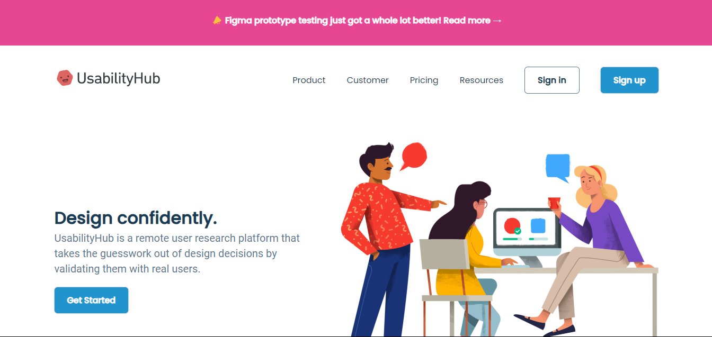

<h2>Modern Landing Page</h2>

<h1><em> Documenation of Project</em> </h1> 
<ul>

This landing page is created using these tech. and you can follows to learn these by tab on given link:-

  <li><a href="https://www.w3schools.com/html/html_intro.asp" target="_blank">HTML</a></li>
  <li><a href="https://www.w3schools.com/css/css_syntax.asp" target="_blank">CSS</a></li>
  </ul>
<button><a href="https://bhartisatyendra.github.io/Modern-Website/" target="_blank">Click me--></a></button>